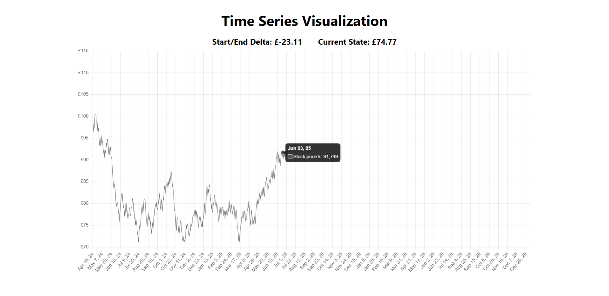

<br/>
<p align="center">
  

  <h3 align="center" style="font-size: 50px;">Time Series Visualization</h3>

  <p align="center">
    Stock price
    <br/>
    <br/>
    <a href="https://hub.docker.com/r/nazartymiv/time-series-visual">Docker Hub</a>
    .
    <a href="https://github.com/NazarTymiv/time-series-visualization/issues">Report Bug</a>
    .
    <a href="https://github.com/NazarTymiv/time-series-visualization/issues">Request Feature</a>
  </p>
</p>

 

## Table Of Contents

- [About the Project](#about-the-project)
- [Built With](#built-with)
- [Getting Started](#getting-started)
  - [Prerequisites](#prerequisites)
  - [Installation](#installation)
- [Usage](#usage)
- [Authors](#authors)

## About The Project



This is a simple web component that visualizes time series data in my case data of stock price.

## Built With

<div style="display: flex; align-items: center;">
  <a href="https://go.dev/" style="margin-right: 15px;">
      
  </a>

  <a href="https://htmx.org/" style="margin-right: 15px;">
      
  </a>

  <a href="https://www.chartjs.org/" style="margin-right: 15px;">
      
  </a>

  <a href="https://tailwindcss.com/" style="margin-right: 15px;">
      
  </a>
</div>

## Getting Started

To get a local copy of this web component and test it manually follow next steps.

### Prerequisites

Install [Golang](https://nodejs.org/en/download/current) for run application.

To verify if Go is installed, open your terminal and type the following command:

```sh
go version
```

If you see the version of Go displayed after running this command, it indicates that everything is installed correctly, and you can continue.

### Installation

#### Github:

```sh
git clone https://github.com/NazarTymiv/time-series-visualization.git
```

#### Docker hub:

```sh
docker pull nazartymiv/time-series-visual
```

## Usage

### For run the application cloned from **Github** use next steps:

1. Open terminal of this app in **VSCode** your location should end on `/time-series-visualization`.

2. To start the **Golang** server, enter the following command:

```sh
go build && ./time-series-visualization
```

3. Open your browser and enter `localhost:4000` in the address bar.

<br />

### For run the application pulled from **Docker hub** use next steps:

1. Open terminal and enter following command for check your docker images:

```sh
docker images

# After executing this command, you should observe the nazartymiv/time-series-visual repository listed among the images.
```

2. Run following command for run docker container:

```sh
docker run -e PORT=4000 -p 4000:4000 nazartymiv/time-series-visual
```

3. Open your browser and enter `localhost:4000` in the address bar.

## Authors

- **Nazar Tymiv** - _Full Stack Software Developer_ - [Gihub Link](https://github.com/NazarTymiv) - [Portfolio Link](https://nazar-tymiv.netlify.app/) - [LinkedIn Link](https://www.linkedin.com/in/nazar-tymiv/)
